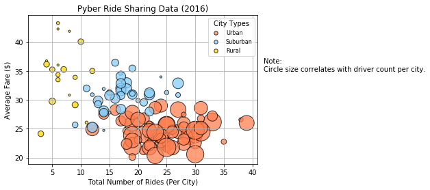
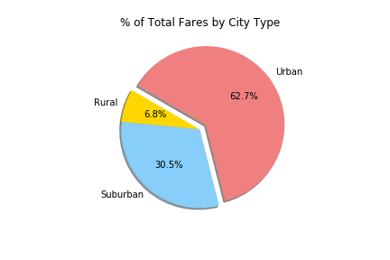
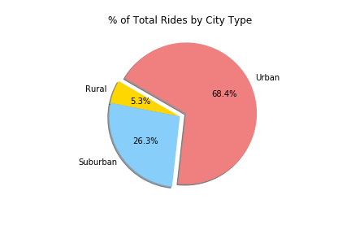
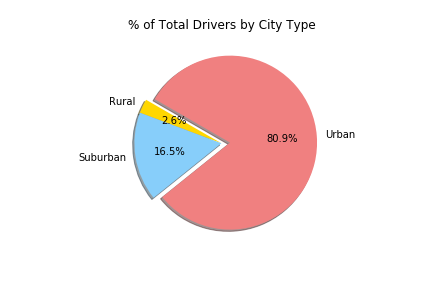

# Matplotlib Pyber
* The majority of the fares, drivers and rides are all from cities classified as urban, followed by those classified as suburban and followed by rural.
* The average fare for rural ares are the highest while urban is the lowest. This correlates with the higher number of drivers in urban areas and the least in rural areas.
*  The current conclusion that the average fare for rural areas is greate than suburban and urban areas is suspect due to the lack of ride duration data. To verify this conclusion the ride duration would need to be collected and compared with the average fare. 

## Dependencies and Setup

```python
%matplotlib inline
%autosave 300
# Dependencies and Setup
import matplotlib.pyplot as plt
import pandas as pd
import numpy as np
```

    Autosaving every 300 seconds
    
## Reading .csv and generating Data Frame

```python
# File to Load (Remember to change these)
city_csv = "../Resources/city_data.csv"
ride_csv = "../Resources/ride_data.csv"

# Read the City and Ride Data
city_raw = pd.read_csv(city_csv)
ride_raw = pd.read_csv(ride_csv)

# Combine the data into a single dataset
raw = ride_raw.merge(city_raw, how = 'left', on = 'city')

# Display the data table for preview
raw.head()
```

<table border="1" class="dataframe">
  <thead>
    <tr style="text-align: right;">
      <th></th>
      <th>city</th>
      <th>date</th>
      <th>fare</th>
      <th>ride_id</th>
      <th>driver_count</th>
      <th>type</th>
    </tr>
  </thead>
  <tbody>
    <tr>
      <th>0</th>
      <td>Lake Jonathanshire</td>
      <td>2018-01-14 10:14:22</td>
      <td>13.83</td>
      <td>5739410935873</td>
      <td>5</td>
      <td>Urban</td>
    </tr>
    <tr>
      <th>1</th>
      <td>South Michelleport</td>
      <td>2018-03-04 18:24:09</td>
      <td>30.24</td>
      <td>2343912425577</td>
      <td>72</td>
      <td>Urban</td>
    </tr>
    <tr>
      <th>2</th>
      <td>Port Samanthamouth</td>
      <td>2018-02-24 04:29:00</td>
      <td>33.44</td>
      <td>2005065760003</td>
      <td>57</td>
      <td>Urban</td>
    </tr>
    <tr>
      <th>3</th>
      <td>Rodneyfort</td>
      <td>2018-02-10 23:22:03</td>
      <td>23.44</td>
      <td>5149245426178</td>
      <td>34</td>
      <td>Urban</td>
    </tr>
    <tr>
      <th>4</th>
      <td>South Jack</td>
      <td>2018-03-06 04:28:35</td>
      <td>34.58</td>
      <td>3908451377344</td>
      <td>46</td>
      <td>Urban</td>
    </tr>
  </tbody>
</table>
</div>

## Generating Data Frames with scatter plot values

```python
# Obtain the x and y coordinates for each of the three city types

# Generate groupby city object
raw_grouped_urban = raw[raw['type'] == 'Urban'].groupby([raw['city']])
raw_grouped_suburban = raw[raw['type'] == 'Suburban'].groupby([raw['city']])
raw_grouped_rural = raw[raw['type'] == 'Rural'].groupby([raw['city']])

# Urban
urban = pd.DataFrame(raw_grouped_urban.count()['ride_id'])
urban.columns = ['x']
urban['y'] = pd.DataFrame(raw_grouped_urban.mean()['fare'])
urban['s'] = pd.DataFrame(raw_grouped_urban.mean()['driver_count'])

# Suburban
suburban = pd.DataFrame(raw_grouped_suburban.count()['ride_id'])
suburban.columns = ['x']
suburban['y'] = pd.DataFrame(raw_grouped_suburban.mean()['fare'])
suburban['s'] = pd.DataFrame(raw_grouped_suburban.mean()['driver_count'])

# Rural
rural = pd.DataFrame(raw_grouped_rural.count()['ride_id'])
rural.columns = ['x']
rural['y'] = pd.DataFrame(raw_grouped_rural.mean()['fare'])
rural['s'] = pd.DataFrame(raw_grouped_rural.mean()['driver_count'])
```

## Generating the scatter plot

```python
# Build the scatter plots for each city types
plt.scatter(urban['x'], urban['y'], label = 'Urban', s = urban['s'] * 10, color = ['coral'], edgecolor = 'black', alpha = .75, marker = 'o')
plt.scatter(suburban['x'], suburban['y'], label = 'Suburban', s = suburban['s'] * 10, color = ['lightskyblue'], edgecolor = 'black', alpha = .75, marker = 'o')
plt.scatter(rural['x'], rural['y'], label = 'Rural', s = rural['s'] * 10, color = ['gold'], edgecolor = 'black', alpha = .75, marker = 'o')
plt.grid()

# Incorporate the other graph properties
plt.xlabel('Total Number of Rides (Per City)')
plt.ylabel('Average Fare ($)')
plt.title('Pyber Ride Sharing Data (2016)')

# Create a legend
legend = plt.legend(fontsize = 8, title= "City Types", loc = "best") 
legend.legendHandles[0]._sizes = [30]
legend.legendHandles[1]._sizes = [30]
legend.legendHandles[2]._sizes = [30]

# Incorporate a text label regarding circle size
plt.text(42,35,"Note: \nCircle size correlates with driver count per city.", fontsize = 10)

# Save Figure
plt.savefig("../Images/Pyber_Ride_Sharing_Data.png", bbox_inches="tight")
```



## Total Fares by City Type

```python
# Calculate Type Percents
raw_grouped_type = raw.groupby([raw['type']])
fare_sum = raw_grouped_type['fare'].sum()

# Build Pie Chart
labels = ["Rural","Suburban","Urban"]
explode = (0, 0, 0.1)
colors = ["gold", "lightskyblue", "lightcoral"]
plt.pie(fare_sum, explode = explode, labels=labels, colors = colors, autopct = "%1.1f%%", shadow = True, startangle = 150)
plt.title("% of Total Fares by City Type")

# Save Figure
plt.savefig("../Images/Total_Fares_by_City_Type.png")
```



## Total Rides by City Type

```python
# Calculate Ride Percents
rides_count = raw_grouped_type['ride_id'].count()

# Build Pie Chart
labels = ["Rural", "Suburban", "Urban"]
explode = (0, 0, 0.1)
colors = ["gold", "lightskyblue", "lightcoral"]
plt.pie(rides_count, explode=explode, labels=labels, colors=colors, autopct="%1.1f%%", shadow=True, startangle=150)
plt.title("% of Total Rides by City Type")

# Save Figure
plt.savefig("../Images/Total_Rides_by_City_Type.png")
```



## Total Drivers by City Type

```python
# Calculate Driver Percents
city_grouped_type = city_raw.groupby(['type'])
drivers_sum = city_grouped_type['driver_count'].sum()

# Build Pie Charts
labels = ["Rural","Suburban","Urban"]
explode = (0, 0, 0.1)
colors = ["gold", "lightskyblue", "lightcoral"]
plt.pie(drivers_sum, explode=explode, labels=labels, colors=colors,autopct="%1.1f%%", shadow=True, startangle=150)
plt.title("% of Total Drivers by City Type")

# Save Figure
plt.savefig("../Images/Total_Drivers_by_City_Type.")
```


