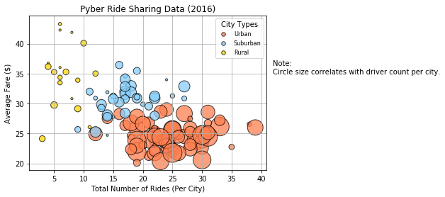
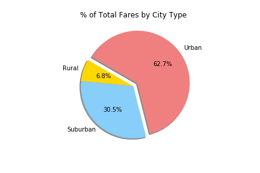
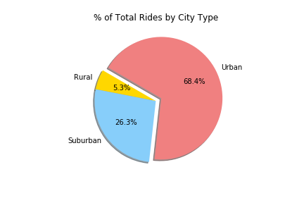
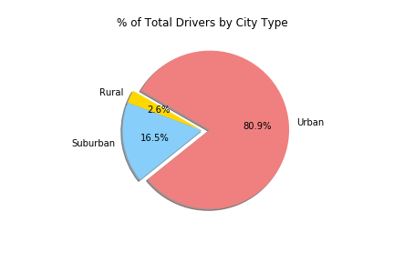

# Matplotlib Pyber

## Dependencies and Setup


```python
%matplotlib inline
%autosave 300
# Dependencies and Setup
import matplotlib.pyplot as plt
import pandas as pd
import numpy as np
```

    Autosaving every 300 seconds
    
## Reading .csv and generating Data Frame


```python
# File to Load (Remember to change these)
city_csv = "../Resources/city_data.csv"
ride_csv = "../Resources/ride_data.csv"

# Read the City and Ride Data
city_raw = pd.read_csv(city_csv)
ride_raw = pd.read_csv(ride_csv)

# Combine the data into a single dataset
raw = ride_raw.merge(city_raw, how = 'left', on = 'city')

# Display the data table for preview
raw.head()
```

<table border="1" class="dataframe">
  <thead>
    <tr style="text-align: right;">
      <th></th>
      <th>city</th>
      <th>date</th>
      <th>fare</th>
      <th>ride_id</th>
      <th>driver_count</th>
      <th>type</th>
    </tr>
  </thead>
  <tbody>
    <tr>
      <th>0</th>
      <td>Lake Jonathanshire</td>
      <td>2018-01-14 10:14:22</td>
      <td>13.83</td>
      <td>5739410935873</td>
      <td>5</td>
      <td>Urban</td>
    </tr>
    <tr>
      <th>1</th>
      <td>South Michelleport</td>
      <td>2018-03-04 18:24:09</td>
      <td>30.24</td>
      <td>2343912425577</td>
      <td>72</td>
      <td>Urban</td>
    </tr>
    <tr>
      <th>2</th>
      <td>Port Samanthamouth</td>
      <td>2018-02-24 04:29:00</td>
      <td>33.44</td>
      <td>2005065760003</td>
      <td>57</td>
      <td>Urban</td>
    </tr>
    <tr>
      <th>3</th>
      <td>Rodneyfort</td>
      <td>2018-02-10 23:22:03</td>
      <td>23.44</td>
      <td>5149245426178</td>
      <td>34</td>
      <td>Urban</td>
    </tr>
    <tr>
      <th>4</th>
      <td>South Jack</td>
      <td>2018-03-06 04:28:35</td>
      <td>34.58</td>
      <td>3908451377344</td>
      <td>46</td>
      <td>Urban</td>
    </tr>
  </tbody>
</table>
</div>


## Generating Data Frames with scatter plot values


```python
# Obtain the x and y coordinates for each of the three city types

# Generate groupby city object
raw_grouped_urban = raw[raw['type'] == 'Urban'].groupby([raw['city']])
raw_grouped_suburban = raw[raw['type'] == 'Suburban'].groupby([raw['city']])
raw_grouped_rural = raw[raw['type'] == 'Rural'].groupby([raw['city']])

# Urban
urban = pd.DataFrame(raw_grouped_urban.count()['ride_id'])
urban.columns = ['x']
urban['y'] = pd.DataFrame(raw_grouped_urban.mean()['fare'])
urban['s'] = pd.DataFrame(raw_grouped_urban.mean()['driver_count'])

# Suburban
suburban = pd.DataFrame(raw_grouped_suburban.count()['ride_id'])
suburban.columns = ['x']
suburban['y'] = pd.DataFrame(raw_grouped_suburban.mean()['fare'])
suburban['s'] = pd.DataFrame(raw_grouped_suburban.mean()['driver_count'])

# Rural
rural = pd.DataFrame(raw_grouped_rural.count()['ride_id'])
rural.columns = ['x']
rural['y'] = pd.DataFrame(raw_grouped_rural.mean()['fare'])
rural['s'] = pd.DataFrame(raw_grouped_rural.mean()['driver_count'])
```

## Generating the scatter plot


```python
# Build the scatter plots for each city types
plt.scatter(urban['x'], urban['y'], label = 'Urban', s = urban['s'] * 10, color = ['coral'], edgecolor = 'black', alpha = .75, marker = 'o')
plt.scatter(suburban['x'], suburban['y'], label = 'Suburban', s = suburban['s'] * 10, color = ['lightskyblue'], edgecolor = 'black', alpha = .75, marker = 'o')
plt.scatter(rural['x'], rural['y'], label = 'Rural', s = rural['s'] * 10, color = ['gold'], edgecolor = 'black', alpha = .75, marker = 'o')
plt.grid()

# Incorporate the other graph properties
plt.xlabel('Total Number of Rides (Per City)')
plt.ylabel('Average Fare ($)')
plt.title('Pyber Ride Sharing Data (2016)')

# Create a legend
legend = plt.legend(fontsize = 8, title= "City Types", loc = "best") 
legend.legendHandles[0]._sizes = [30]
legend.legendHandles[1]._sizes = [30]
legend.legendHandles[2]._sizes = [30]

# Incorporate a text label regarding circle size
plt.text(42,35,"Note: \nCircle size correlates with driver count per city.", fontsize = 10)

# Save Figure
plt.savefig("../Images/Pyber_Ride_Sharing_Data.png", bbox_inches="tight")
```




## Total Fares by City Type


```python
# Calculate Type Percents
raw_grouped_type = raw.groupby([raw['type']])
fare_sum = raw_grouped_type['fare'].sum()

# Build Pie Chart
labels = ["Rural","Suburban","Urban"]
explode = (0, 0, 0.1)
colors = ["gold", "lightskyblue", "lightcoral"]
plt.pie(fare_sum, explode = explode, labels=labels, colors = colors, autopct = "%1.1f%%", shadow = True, startangle = 150)
plt.title("% of Total Fares by City Type")

# Save Figure
plt.savefig("../Images/Total_Fares_by_City_Type.png")
```




## Total Rides by City Type


```python
# Calculate Ride Percents
rides_count = raw_grouped_type['ride_id'].count()

# Build Pie Chart
labels = ["Rural", "Suburban", "Urban"]
explode = (0, 0, 0.1)
colors = ["gold", "lightskyblue", "lightcoral"]
plt.pie(rides_count, explode=explode, labels=labels, colors=colors, autopct="%1.1f%%", shadow=True, startangle=150)
plt.title("% of Total Rides by City Type")

# Save Figure
plt.savefig("../Images/Total_Rides_by_City_Type.png")
```




## Total Drivers by City Type


```python
# Calculate Driver Percents
city_grouped_type = city_raw.groupby(['type'])
drivers_sum = city_grouped_type['driver_count'].sum()

# Build Pie Charts
labels = ["Rural","Suburban","Urban"]
explode = (0, 0, 0.1)
colors = ["gold", "lightskyblue", "lightcoral"]
plt.pie(drivers_sum, explode=explode, labels=labels, colors=colors,autopct="%1.1f%%", shadow=True, startangle=150)
plt.title("% of Total Drivers by City Type")

# Save Figure
plt.savefig("../Images/Total_Drivers_by_City_Type.")
```


